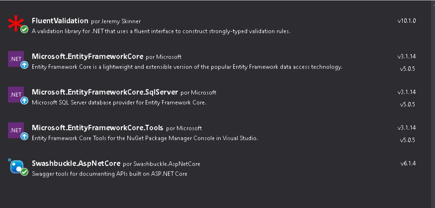

# MiniMarket

Pequeño BackEnd para administrar los Productos de una tienda

## Stack que use para crear el backend

1. Visual Studio 2019
2. .NET Core 3.1 con Entity Framework Core
3. Sql Server 2019

### Paquetes NuGeT que uso

  
  
## Pasos que recomiendo realizar para realizar pruebas

1. Clonar el repositorio
2. Instalar los Paquetes NuGet's
3. Cambiar la cadena de Conexión que esta en el Archivo [appsettings.json](/MiniMarketBackEnd/appsettings.json) 
4. En la consola de los Paquetes NuGet's ejecutar el comando '''update-database''' para crear la base de datos e insertar datos de pruebas
5. En la base de datos ejecutar el escript SQL que esta en la Carpeta Recursos, Para crear la tabla ProductHistory, el procedimiento Almacenado Get_Products y el triger TR_ProductUpdate
5. Ejecutar la solución :).
